# wecc_proof_of_concept
This repository demonstrates the GODEEEP project's approach to projecting load, wind, and solar time series under 
climate change.

## Input Files
The input data needed to recreate this demonstration is stored in the [data](data/) directory.

## Output Files
Average load, wind and solar ratio data by BA is stored in the [data](data/) directory. These ratios were calculated 
by taking the load, wind, and solar time series with climate change included (i.e., 2058) and dividing those by the 
time series from the base year (i.e., 2018). For completeness we computed annual mean ratios, mean ratios by month, and 
mean ratios during the July 2018 heat wave event in the western U.S. Because the wind and solar capacity factors 
occasionally have very small values that make calculating ratios risky we capped the wind and solar capacity ratios at 
a maximum value of 3 before computing the averages. Missing values in the output files (e.g., when there is not enough 
wind or solar deployed in a BA) are marked as -999.

## Summary Plots
Quick-look plots analyzing the data are stored in the [plots](plots/) directory.

## Results by Balancing Authority 
>
| BA | Load Time Series | Solar Time Series | Wind Time Series |
| :-: | :-: | :-: | :-: |
| AZPS  | 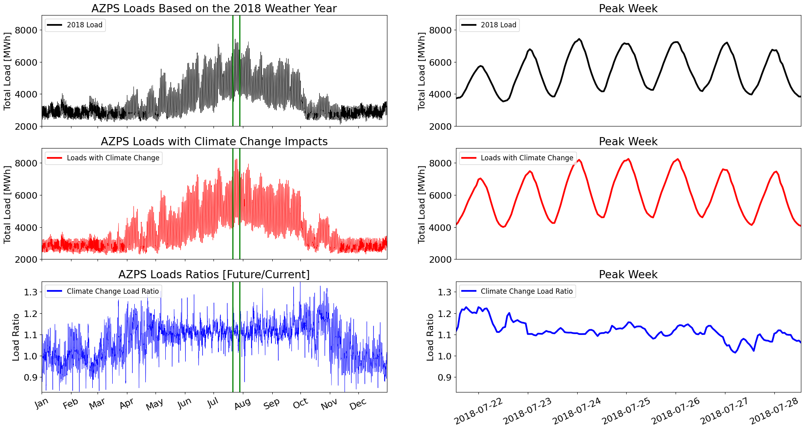  | 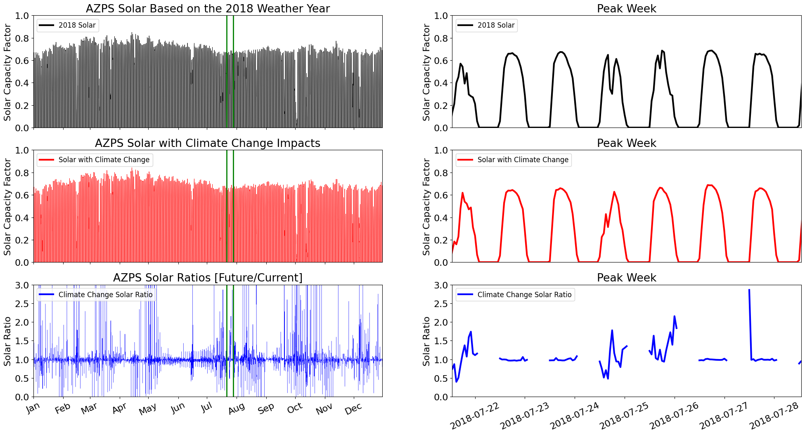  | 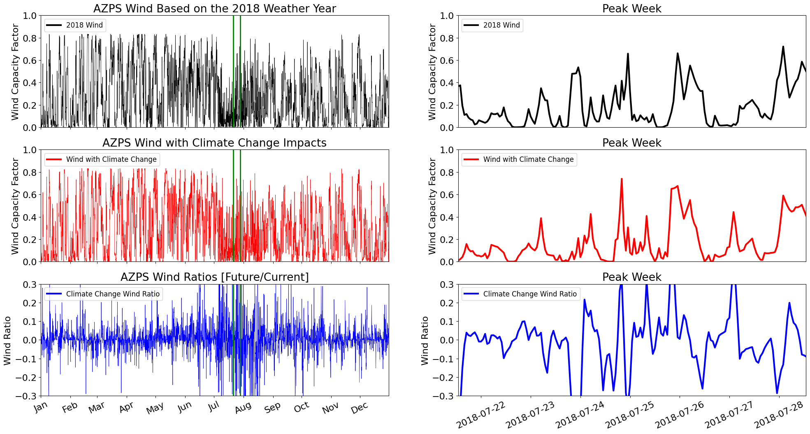  |
| BPAT  | 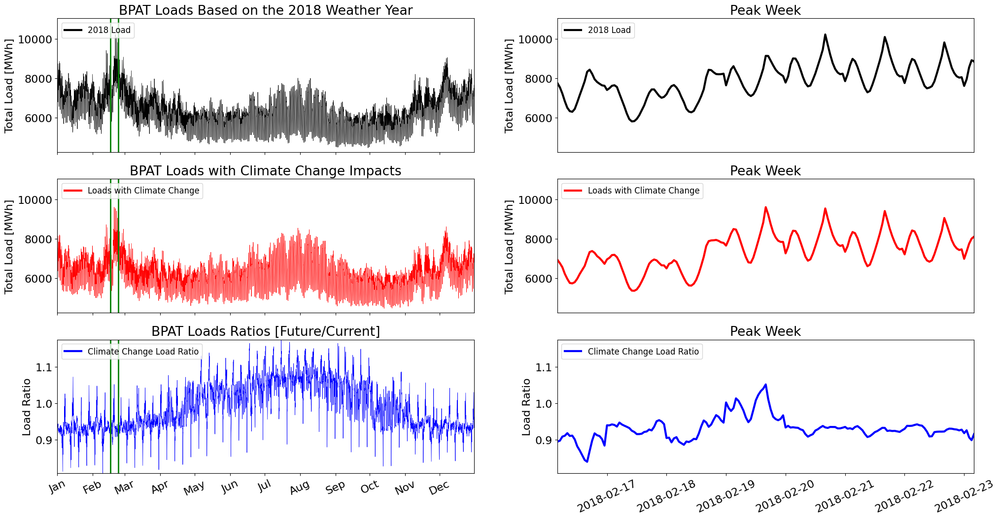  | 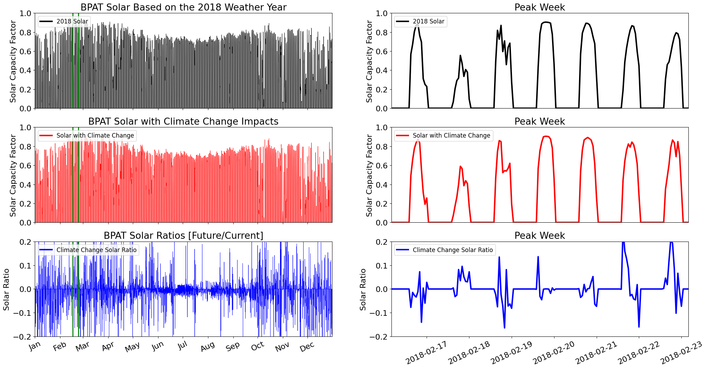  | 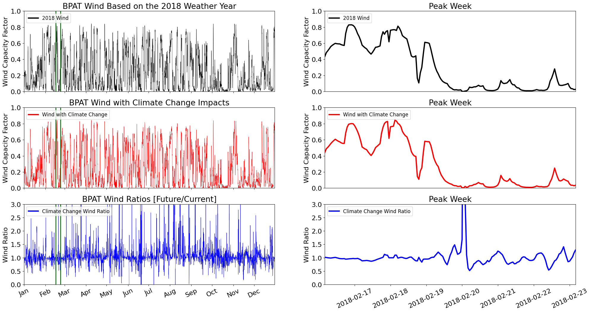  |
| CISO  |   |   | 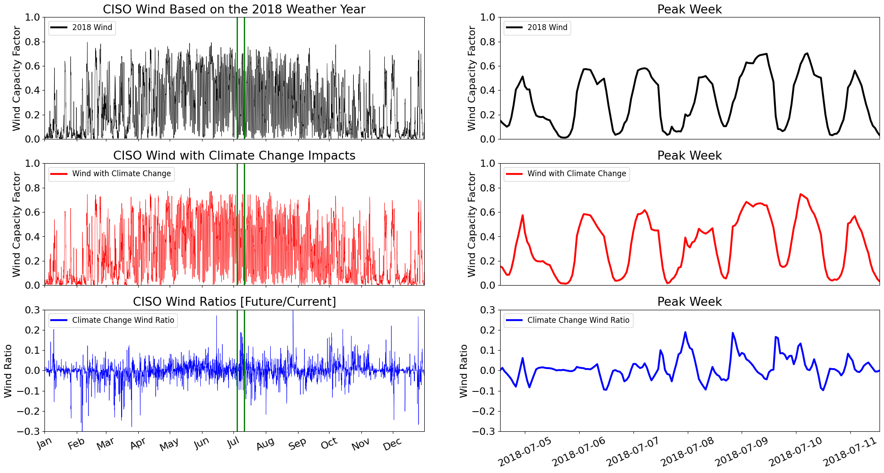  |
| PNM  | 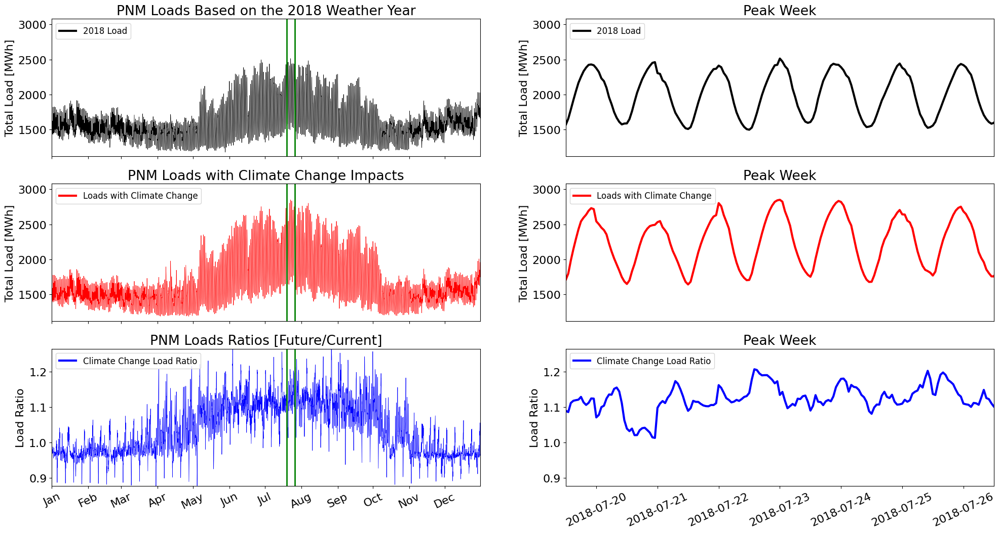  | 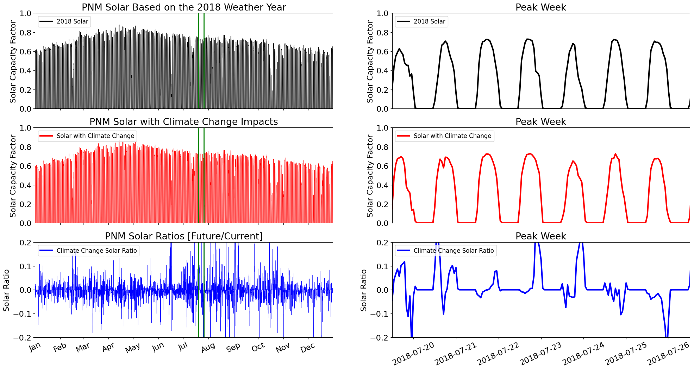  | 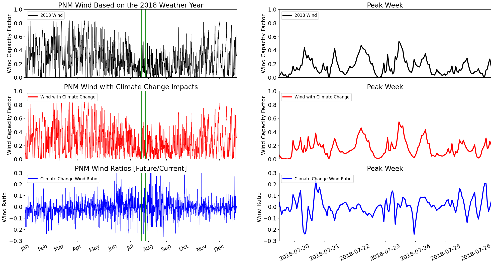  |
| PSCO  | 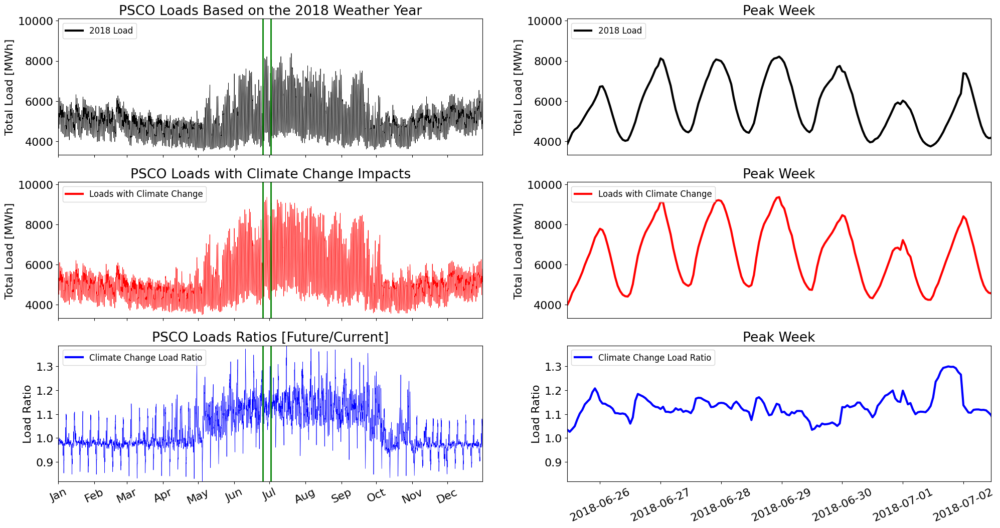  |   | 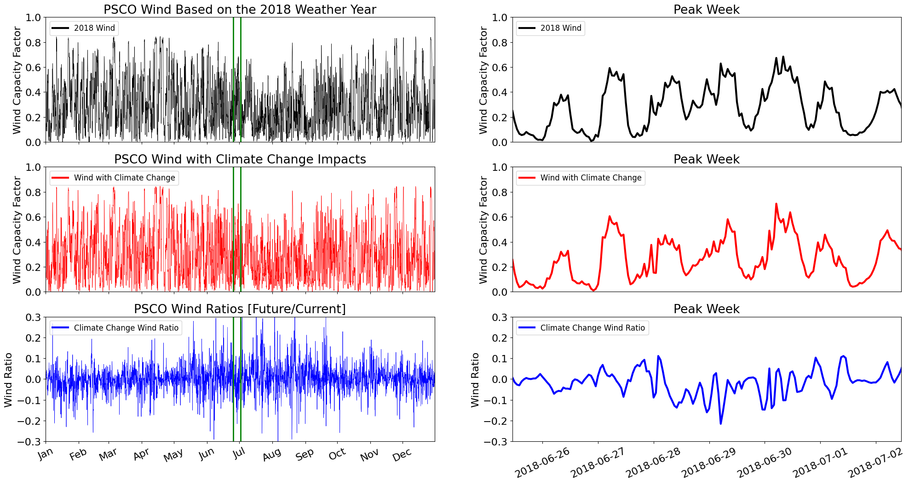  |