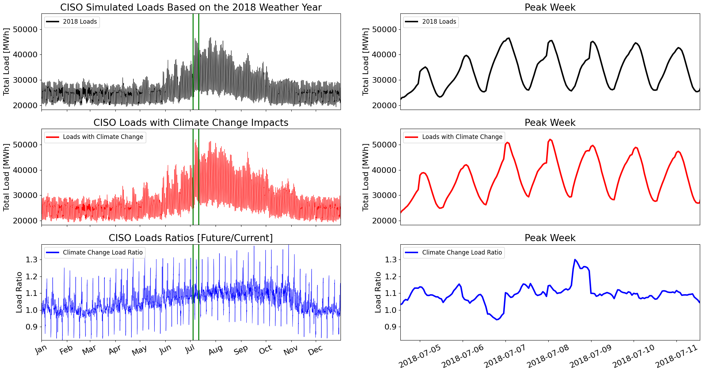

# wecc_proof_of_concept
This repository demonstrates the GODEEEP project's approach to projecting load, wind, and solar time series under 
climate change.

## Input Files
The input data needed to recreate this demonstration is stored in the [data](data/) directory.

## Summary Plots
Quick-look plots analyzing the data are stored in the [plots](plots/) directory.

## Results by Balancing Authority 
>
| BA | Load Time Series |
| :-: | :-: |
| CISO  |   |
